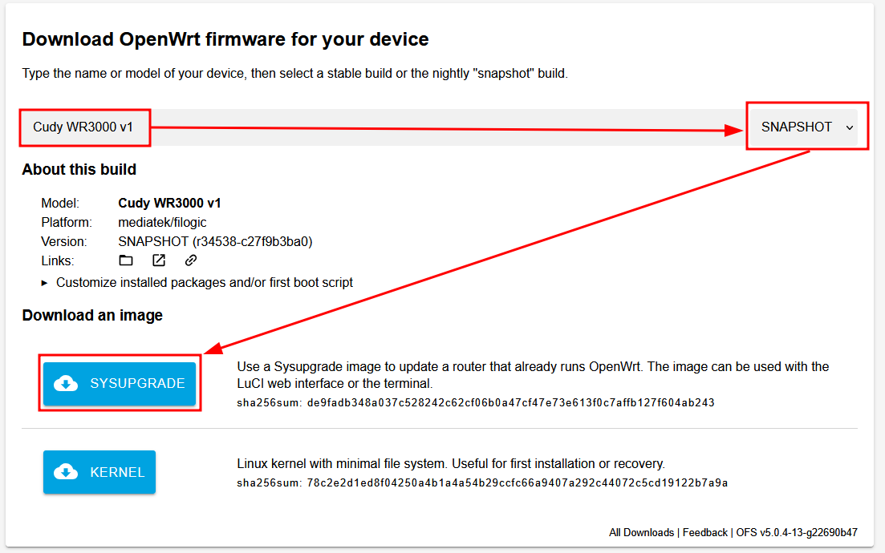
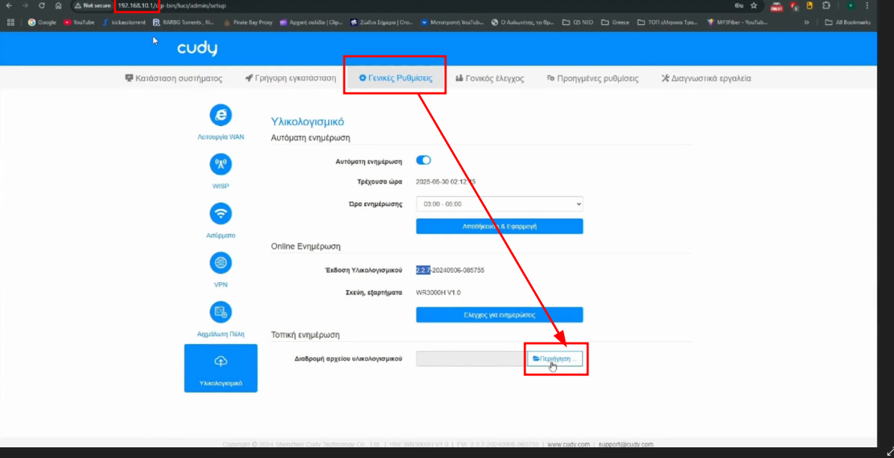
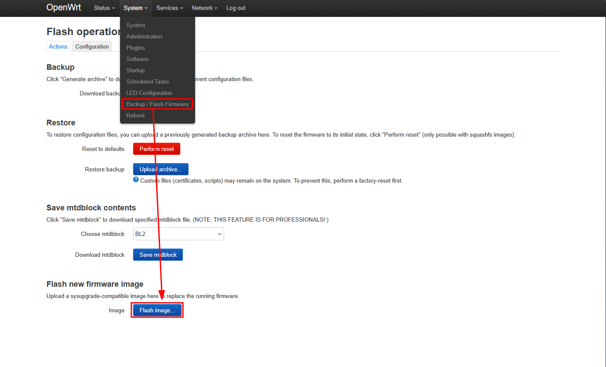
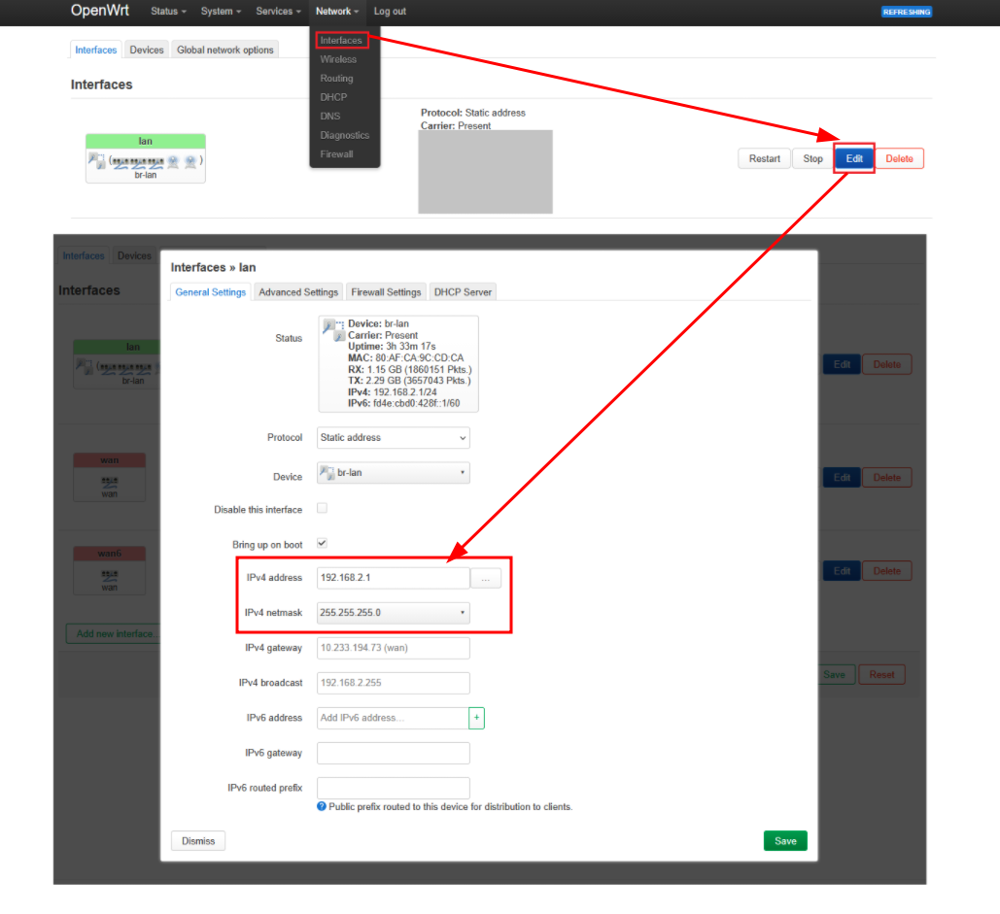
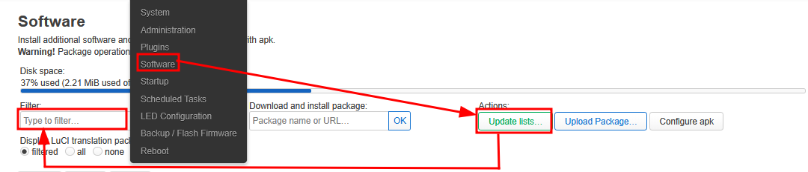
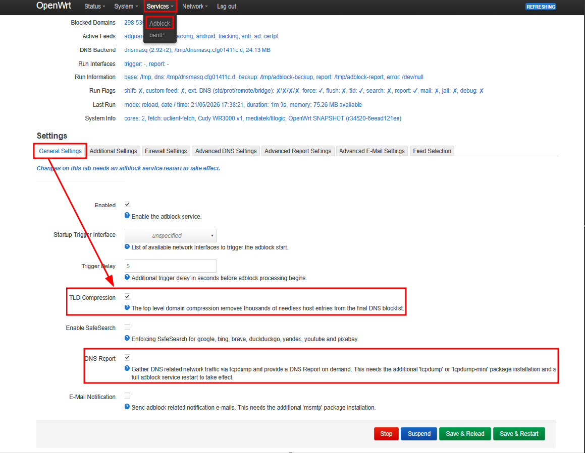
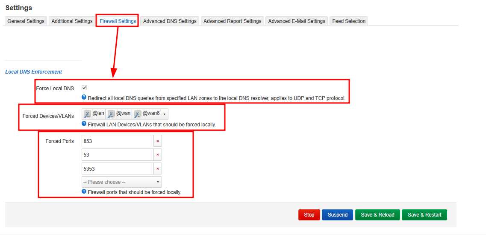
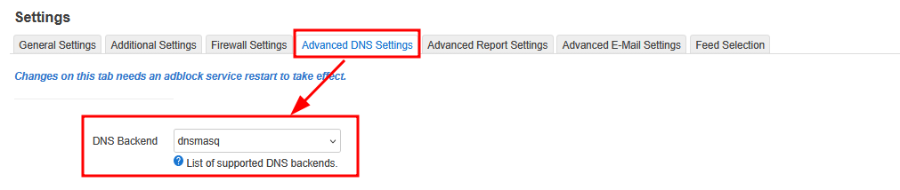
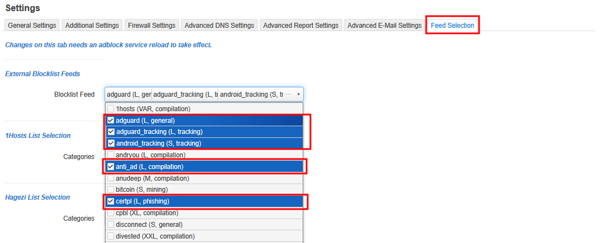
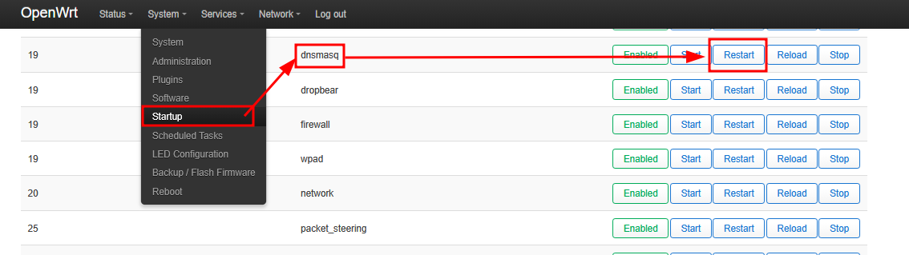

# 🚀 Cudy + OpenWrt Tutorial

This guide walks you through upgrading your **Cudy router** to
OpenWrt, enabling LuCI Web UI, blocking ads, setting up WireGuard VPN
(general steps and provider-specific instructions), and managing IPv6.

# 🛒 Buying Suggestion
Buying Suggestion: Prefer the Cudy WR3000E over other WR3000 variants if you plan to install OpenWrt — it offers significantly more memory, supports Wi-Fi 6, and overall provides excellent value for money (VFM)

------------------------------------------------------------------------

## 📥 Step 1 --- Download Required Files

1.  **OpenWrt Firmware (without recovery TFTP):**
    Select the appropriate firmware according to your router’s model. [Download here](./Cudy%20Intermediary%20OpenWRT%20Firmware/)

2.  **OpenWrt Firmware Finder (SNAPSHOT builds):**
    Select the firmware that matches your router’s model; ensure the version chosen is `SNAPSHOT`.
    <details>
        <summary><a href="https://firmware-selector.openwrt.org/">Download Here</a></summary>
        <p align="center">
            
        </p>
    </details>

3.  **PuTTY (SSH client):**
    [Download PuTTY](https://www.putty.org/)

------------------------------------------------------------------------

## ⚡ Step 2 --- Flash OpenWrt

1.  Access router at `192.168.10.1` (Cudy's portal).
2.  <details>
        <summary>Upgrade the firmware using the OpenWrt image downloaded in Step 1.1.</summary>
        <p align="center">
            
        </p>
    </details>
3.  After upgrade → go to
    `192.168.1.1 → System → Backup / Flash Firmware`.
4.  <details>
        <summary>Upload new file and start upgrade using the image download in Step 1.2.</summary>
        <p align="center">
            
        </p>
    </details>
5.  Since the snapshot has no UI:
    -   Open **PuTTY** and connect to `192.168.1.1` via SSH.
    -   Login as `root` (no password first time).

------------------------------------------------------------------------

> If an error occurs at any stage of the process, you can simply SSH into the system and run `firstboot && reboot`

## 🖥️ Step 3 --- Install LuCI Web Interface

```sh
apk update
apk add luci
apk add luci-ssl
/etc/init.d/uhttpd restart
uci set uhttpd.main.redirect_https=1
uci commit uhttpd
/etc/init.d/uhttpd restart
```

------------------------------------------------------------------------

<details>
<summary><span style="font-size:1.5em;font-weight:600">🐣 Beginners (Setup using Interface)</span></summary>

👉 After restart, log in at `192.168.1.1` via LuCI.
-   Set a new password for root.
-   Go to **Network → Interfaces → LAN**
    -   <details>
            <summary>Change IPv4 address → `192.168.2.1/24`</summary>
            <p align="center">
                
            </p>
        </details>
    -   **Save & Apply**


### 🛡️ Step 4 --- Adblock (network-wide ad/tracker blocking)

1.  Go to **System → Software**
    -   Update Lists
    -   Install: `adblock`, `luci-app-adblock`
    -   <details>
            <summary>Image Here</summary>
            <p align="center">
                
            </p>
        </details>

2.  Configure via **Services → Adblock**:
    - **General Settings**
        -   ✔ TLD Compression
        -   ✔ DNS Report
        -   <details>
                <summary>Images Here</summary>
                <p align="center">
                    
                </p>
            </details>
    - **Firewall Settings**
        -   Forced Zones → `@lan`, `@wan`, `@wan6`
        -   Forced Ports → `853`, `53`, `5353`
        -   <details>
                <summary>Images Here</summary>
                <p align="center">
                    
                </p>
            </details>
    - **Advanced DNS Settings**
        - DNS Backend → `dnsmasq`
        - <details>
                <summary>Image Here</summary>
                <p align="center">
                    
                </p>
            </details>
    - **Feed Selection**
        - Blocklist Feed → `adguard (L, general)`, `adguard_tracking (L, tracking)`, `android_tracking (S, tracking)`, `anti_ad (L, compilation)`, `certpl (L, phishing)`
        - <details>
                <summary>Image Here</summary>
                <p align="center">
                    
                </p>
            </details>
3.  Restart **dnsmasq** from **System → Startup**.
    <details>
        <summary>Image Here</summary>
        <p align="center">
            
        </p>
    </details>

------------------------------------------------------------------------

### 🔐 Step 5 --- WireGuard VPN client (route LAN through a VPN provider)

1.  Go to **System → Software**
    -   Update Lists
    -   Install: `luci-proto-wireguard`
    -   Reboot
2.  Go to **Network → Interfaces**
    -   Add new interface
    -   Name → `wg0`
    -   Protocol → **WireGuard VPN**
	-   Create interface
3.  Firewall Setup:
    -   Go to **Network → Firewall**
    -   Add Zone:
        -   Name → `vpn`
        -   ✔ IPv4 Masquerading
        -   ✔ MSS Clamping
        -   Covered Networks → `wg0`
		-   Allow forward from source zones → `lan`
    -   **Lan Forwarding**:
		-   Edit `lan` → Allow forward to destination zones → `wg0`
4.  Go again to **Network → Interfaces**
    -   Edit interface with Name → `wg0`
    -   Go to `Firewall Settings`
    -   Create / Assign firewall-zone → `vpn` (see step 2)
	-   **Save & Apply**
5.  Kill Switch Rule (Optional):
    -   Go to **Traffic Rules**
    -   Add Rule:
        -   Name → `vpn-killswitch`
        -   Source Zone → `lan`
        -   Destination Zone → `wan`
        -   Action → **drop**

------------------------------------------------------------------------

### 🌍 Step 5.2 --- VPN Provider Configuration
<details>
<summary><strong>🛰️ NordVPN</strong></summary>

1.  **Generate Credentials**
    -   Go to [Nord Account Access Tokens](https://my.nordaccount.com/dashboard/nordvpn/access-tokens/)
        → `Generate a token`.
    -   Use the provided .exe file `./nordvpn_priv_key_extractor.exe` to generate a **private key also known as `nordlynx_private_key`**.
2.  **Find Your Recommended Server**
    -   Go to [NordVPN Manual
        Configuration](https://my.nordaccount.com/dashboard/nordvpn/manual-configuration/server-recommendation/).
3.  **Download Configuration**
    -   From [Nord Configs](https://wg-nord.pages.dev/)
    -   Open the downloaded `.conf` file and insert your **private key also known as `nordlynx_private_key`**.
4.  **Configure WireGuard**
    -   Go to **Network → Interfaces → wg0**
    -   Import your configuration file → **Load configuration...**
    -   In Peers → Edit → ✔ Route Allowed IPs
    -   **Save**

</details>

------------------------------------------------------------------------

</details>

<details>
<summary><span style="font-size:1.5em;font-weight:600">⚡ Advanced (Setup using SSH Connection)</span></summary>

👉 After restart, open **PuTTY** and connect to `192.168.1.1` via SSH
```sh
# Set a new root password
passwd root
# Change IPv4 address to 192.168.2.1/24
uci set network.lan.ipaddr="192.168.2.1"
uci set network.lan.netmask='255.255.255.0'

# Set WiFi
uci set wireless.radio0.cell_density='0'
uci set wireless.default_radio0.ssid='<WIFI_NAME>'
uci set wireless.default_radio0.encryption='sae-mixed'
uci set wireless.default_radio0.key='<WIFI_PASS>'
uci set wireless.default_radio0.ocv='0'
uci delete wireless.default_radio0.disabled

uci set wireless.radio1.cell_density='0'
uci set wireless.default_radio1.ssid='<WIFI_NAME>'
uci set wireless.default_radio1.encryption='sae-mixed'
uci set wireless.default_radio1.key='<WIFI_PASS>'
uci set wireless.default_radio1.ocv='0'
uci delete wireless.default_radio1.disabled

uci commit wireless
uci commit network
wifi reload
/etc/init.d/network restart
```

<details>
<summary><span style="font-size:1.2em;font-weight:600">🛡️ Step 4 --- Adblock (network-wide ad/tracker blocking)</span></summary>

```sh
# 1. Install packages
apk add adblock luci-app-adblock banip luci-app-banip

# 2 & 3. Configure adblock
uci set adblock.global.adb_enabled='1'
uci set adblock.global.adb_report='1'
uci set adblock.global.adb_nftforce='1'
uci set adblock.global.adb_dns='dnsmasq'
uci set adblock.global.adb_fetchcmd='uclient-fetch'
uci set adblock.global.adb_nftdevforce='@lan' '@wan' '@wan6'
uci set adblock.global.adb_nftportforce='853' '53' '5353'
uci set adblock.global.adb_feed='adguard' 'adguard_tracking' 'android_tracking' 'anti_ad' 'certpl'
uci set adblock.global.adb_forcedns='1'
uci set adblock.global.adb_zonelist='wan lan'
uci set adblock.global.adb_portlist='53 853 5353'
uci set adblock.global.adb_tld='1'
uci set adblock.global.adb_fetchutil='uclient-fetch'

uci commit adblock

# 4. Make dnsmasq ignore /etc/resolv.conf
uci delete dhcp.@dnsmasq[0].server
uci set dhcp.@dnsmasq[0].noresolv='1'

uci add_list dhcp.@dnsmasq[0].server='9.9.9.9'
uci add_list dhcp.@dnsmasq[0].server='149.112.112.112'

uci commit dhcp
/etc/init.d/dnsmasq restart
/etc/init.d/adblock enable
/etc/init.d/adblock start

# 5. Block DoH bypass
uci set banip.global.ban_enabled='1'
uci set banip.global.ban_autodetect='1'
uci set banip.global.ban_protov4='1'
uci set banip.global.ban_protov6='1'
uci set banip.global.ban_logprerouting='0'
uci set banip.global.ban_logforwardwan='0'
uci set banip.global.ban_logforwardlan='0'
uci -q delete banip.global.ban_feed
uci set banip.doh=feed
uci set banip.doh.ban_fetchchain='outbound'

uci commit banip
service banip restart
```

</details>

------------------------------------------------------------------------

<details>
<summary><span style="font-size:1.2em;font-weight:600">🔐 Step 5 --- WireGuard VPN client (route LAN through a VPN provider)</span></summary>

1. Install the packages
    ```sh
    apk update
    apk add wireguard-tools kmod-wireguard luci-proto-wireguard luci-app-wireguard
    reboot
    ```

2. Assumption: you already have a WireGuard `.conf` file in hand. Standard format:
    ```ini
    [Interface]
    PrivateKey = xxxxxxxxxxxxxxxxxxxxxxxxxxxxxxxxxxxxxxxxxxx=
    Address    = 10.64.0.2/32
    DNS        = 10.64.0.1
    
    [Peer]
    PublicKey  = yyyyyyyyyyyyyyyyyyyyyyyyyyyyyyyyyyyyyyyyyyy=
    Endpoint   = se-mma-wg-001.mullvad.net:51820
    AllowedIPs = 0.0.0.0/0, ::/0
    ```

    You'll copy five values out of that file:
 
    | Placeholder in the snippet | Source in your `.conf`        |
    | -------------------------- | ----------------------------- |
    | `<PRIVATE_KEY>`            | `[Interface] PrivateKey`      |
    | `<ADDRESS>`                | `[Interface] Address`         |
    | `<DNS>`                    | `[Interface] DNS`             |
    | `<PEER_PUBLIC_KEY>`        | `[Peer] PublicKey`            |
    | `<ENDPOINT_HOST>`          | host part of `[Peer] Endpoint`  (everything before `:51820`)|


    ```sh
    # Interface
    uci set network.wg0=interface
    uci set network.wg0.proto='wireguard'
    uci set network.wg0.private_key='<PRIVATE_KEY>'
    uci -q delete network.wg0.addresses
    uci add_list network.wg0.addresses='<ADDRESS>'        
    uci -q delete network.wg0.dns
    uci add_list network.wg0.dns='<DNS>'
    
    uci set network.peer0=wireguard_wg0
    uci set network.peer0.description='VPN provider'
    uci set network.peer0.public_key='<PEER_PUBLIC_KEY>'
    uci set network.peer0.endpoint_host='<ENDPOINT_HOST>'
    uci set network.peer0.endpoint_port='51820'
    uci set network.peer0.route_allowed_ips='1'
    uci set network.peer0.persistent_keepalive='25'
    uci -q delete network.peer0.allowed_ips
    uci add_list network.peer0.allowed_ips='0.0.0.0/0'
    uci add_list network.peer0.allowed_ips='::/0'
    
    uci commit network
    /etc/init.d/network reload
    ```

3. Firewall (kill-switch style)
    One `vpn` zone for `wg0`, with masquerading. We also remove the default `lan → wan` forwarding so traffic *only* leaves through the VPN — if the tunnel drops, nothing leaks to your ISP.

    ```sh
    # Named VPN zone covering wg0
    uci set firewall.vpn=zone
    uci set firewall.vpn.name='vpn'
    uci set firewall.vpn.input='REJECT'
    uci set firewall.vpn.output='ACCEPT'
    uci set firewall.vpn.forward='REJECT'
    uci set firewall.vpn.masq='1'
    uci set firewall.vpn.mtu_fix='1'
    uci -q delete firewall.vpn.network
    uci add_list firewall.vpn.network='wg0'
    
    # Named forwarding lan -> vpn
    uci set firewall.lan_to_vpn=forwarding
    uci set firewall.lan_to_vpn.src='lan'
    uci set firewall.lan_to_vpn.dest='vpn'
    
    # KILL SWITCH: remove the default lan -> wan forwarding
    for fwd in $(uci -q show firewall | sed -n "s/^firewall\.\([^.]*\)=forwarding$/\1/p"); do
        src=$(uci -q get firewall."$fwd".src)
        dest=$(uci -q get firewall."$fwd".dest)
        if [ "$src" = "lan" ] && [ "$dest" = "wan" ]; then
            uci delete firewall."$fwd"
            break
        fi
    done
    
    uci commit firewall
    service firewall restart
    ```

    > **Don't want a kill switch?** Skip the loop that deletes `lan → wan`. With it left in place, if the VPN drops, traffic falls back to your regular ISP (privacy-leaking but no outages).

4.  **Fail-safe: a `killswitch` toggle script**

    The kill switch is great until your VPN config expires (looking at you, NordVPN), your provider has an outage, or you simply mistype an `Endpoint` and the LAN has no internet. You can always SSH into the router from LAN even when the kill switch is on — the router's own input policy isn't affected — so you'll never be fully locked out. But you want a one-line escape hatch.
 
    This script lets you flip the kill switch on and off without remembering UCI syntax in a panic:

    ```sh
    cat > /usr/bin/killswitch <<'EOF'
    #!/bin/sh
    # Toggle the VPN kill switch (lan -> wan forwarding) on or off.
    # Usage: killswitch {on|off|status}
    
    set -e
    
    find_fwd_lan_wan() {
        # Print the section id of the firewall.forwarding entry where src=lan, dest=wan
        for f in $(uci -q show firewall | sed -n "s/^firewall\.\([^.]*\)=forwarding$/\1/p"); do
            [ "$(uci -q get firewall."$f".src)"  = "lan" ] || continue
            [ "$(uci -q get firewall."$f".dest)" = "wan" ] || continue
            echo "$f"; return 0
        done
        return 1
    }
    
    case "$1" in
        off)
            # Restore lan -> wan so LAN reaches the internet directly again
            if find_fwd_lan_wan >/dev/null; then
                echo "Kill switch already OFF (lan -> wan forwarding exists)"
                exit 0
            fi
            uci set firewall.lan_to_wan=forwarding
            uci set firewall.lan_to_wan.src='lan'
            uci set firewall.lan_to_wan.dest='wan'
            uci commit firewall
            service firewall reload
            echo "Kill switch OFF — LAN now has direct internet (no VPN)."
            echo "Optional: 'ifdown wg0' to stop the tunnel entirely."
            ;;
        on)
            # Remove lan -> wan so LAN traffic only leaves via VPN
            f=$(find_fwd_lan_wan) || { echo "Kill switch already ON (no lan -> wan forwarding)"; exit 0; }
            uci delete firewall."$f"
            uci commit firewall
            service firewall reload
            echo "Kill switch ON — LAN traffic only exits through wg0."
            echo "Make sure 'ifup wg0' is up or LAN will have no internet."
            ;;
        status)
            if find_fwd_lan_wan >/dev/null; then
                echo "Kill switch: OFF (lan -> wan forwarding present)"
            else
                echo "Kill switch: ON  (no lan -> wan forwarding)"
            fi
            echo
            echo "wg0:"
            wg show wg0 2>/dev/null || echo "  (interface down or not configured)"
            ;;
        *)
            echo "Usage: killswitch {on|off|status}"
            exit 1
            ;;
    esac
    EOF
    chmod +x /usr/bin/killswitch
    ```

    Use it like this:
    ```sh
    killswitch status     # see what state you're in
    killswitch off        # disable kill switch — LAN gets direct internet again
    killswitch on         # re-enable kill switch — LAN routes through wg0 only
    ```
    > Even with the kill switch ON and `wg0` down, the router itself can still reach the internet (the kill switch only governs *forwarded* traffic from LAN). That means you can `ssh root@192.168.1.1` from any LAN device, run `killswitch off`, fix your config, and re-enable. You're never truly locked out.

    **A more aggressive fail-safe (optional):** drop a copy of `killswitch off` as `/root/PANIC.sh` so you can run `sh /root/PANIC.sh` blindly:

    ```sh
    cat > /root/PANIC.sh <<'EOF'
    #!/bin/sh
    # Emergency: disable kill switch and bring wg0 down.
    /usr/bin/killswitch off
    ifdown wg0 2>/dev/null
    echo "Done. You should have normal internet now."
    EOF
    chmod +x /root/PANIC.sh
    ```
4. Verify
    
    Bring up the tunnel and check:
    ```sh
    ifup wg0
    wg show
    # Look for `latest handshake: X seconds ago` — should appear within ~30s
    ```

    Confirm your external IP changed (from a LAN client, or from the router itself):
 
    ```sh
    curl ifconfig.co
    curl ifconfig.co/country
    ```

    Check for DNS leaks: <https://dnsleaktest.com> from a LAN client.
    > **NordVPN gotcha:** if the handshake never completes, the config may have expired (Nord rotates keys on manually-extracted configs) or the server may have stopped accepting manual WireGuard. Regenerate the config and try a different server hostname.

</details>

------------------------------------------------------------------------

<details>
<summary><span style="font-size:1.2em;font-weight:600">📄🔓 Step 5.1 --- VPN Whitelisting (Enable Policy-Based Routing)</span></summary>

1. **Install**
   ```sh
   opkg update
   opkg install pbr luci-app-pbr
   service rpcd restart
   ```

2. **Enable PBR globally**
   ```sh
   uci set pbr.config.enabled='1'
   uci set pbr.config.strict_enforcement='1'   # drop traffic if a policy's interface is down (no silent fallback)
   uci set pbr.config.resolver_set='nft'       # use nftables (correct for fw4 / OpenWrt 22.03+)
   uci set pbr.config.verbosity='1'            # quieter logs once you trust the setup
   uci commit pbr
   service pbr enable
   service pbr restart
   ```
 
   > **About `strict_enforcement='1'`** — if a policy says "route through `wg0`" and `wg0` is down, the traffic is **dropped** instead of falling back to `wan`. This prevents accidental leaks when the VPN flaps. Set to `'0'` if you'd rather have fallback.

 
3. **Add a bypass policy (one per device or group)**
   3.1 — Bypass VPN by MAC address
   For a smart TV (`AA:BB:CC:DD:EE:FF`) that should use the regular ISP connection:
   ```sh
   uci set pbr.smart_tv=policy
   uci set pbr.smart_tv.name='Smart TV'
   uci set pbr.smart_tv.src_mac='AA:BB:CC:DD:EE:FF'
   uci set pbr.smart_tv.interface='wan'        # bypass VPN, exit via wan
   uci set pbr.smart_tv.enabled='1'
   uci commit pbr
   service pbr reload
   ```
 
   3.2 — Force a device ONLY through VPN
   For a work laptop (`11:22:33:44:55:66`) that must always use VPN, even if other devices don't:
   ```sh
   uci set pbr.work_laptop=policy
   uci set pbr.work_laptop.name='Work Laptop'
   uci set pbr.work_laptop.src_mac='11:22:33:44:55:66'
   uci set pbr.work_laptop.interface='wg0'     # force through VPN
   uci set pbr.work_laptop.enabled='1'
   uci commit pbr
   service pbr reload
   ```
 
   3.3 — Bypass VPN for specific destination domains/IPs
   For banking sites that block known VPN exits — route them via `wan` for *all* LAN clients:
   ```sh
   uci set pbr.banking=policy
   uci set pbr.banking.name='Banking sites'
   uci set pbr.banking.dest_addr='chase.com paypal.com revolut.com'
   uci set pbr.banking.interface='wan'
   uci set pbr.banking.enabled='1'
   uci commit pbr
   service pbr reload
   ```
 
   3.4 — Bypass by source IP range
   For a VLAN, subnet, or specific static-IP device:
   ```sh
   uci set pbr.iot_subnet=policy
   uci set pbr.iot_subnet.name='IoT subnet'
   uci set pbr.iot_subnet.src_addr='192.168.1.100-192.168.1.150'
   uci set pbr.iot_subnet.interface='wan'
   uci set pbr.iot_subnet.enabled='1'
   uci commit pbr
   service pbr reload
   ```
 
   > `src_addr` accepts single IPs, ranges (`a-b`), or CIDR (`192.168.1.0/28`).
   3.5 — Bypass a single port (e.g. Steam, Plex)
   ```sh
   uci set pbr.steam=policy
   uci set pbr.steam.name='Steam game traffic'
   uci set pbr.steam.proto='tcp udp'
   uci set pbr.steam.dest_port='27015 27036'
   uci set pbr.steam.interface='wan'
   uci set pbr.steam.enabled='1'
   uci commit pbr
   service pbr reload
   ```
 
   3.6 — Combine criteria
   Fields can be combined within a single policy. For example, *"this MAC, only for these ports, via VPN"*:
   ```sh
   uci set pbr.laptop_torrents=policy
   uci set pbr.laptop_torrents.name='Laptop torrents'
   uci set pbr.laptop_torrents.src_mac='11:22:33:44:55:66'
   uci set pbr.laptop_torrents.proto='tcp'
   uci set pbr.laptop_torrents.dest_port='6881-6889'
   uci set pbr.laptop_torrents.interface='wg0'
   uci set pbr.laptop_torrents.enabled='1'
   uci commit pbr
   service pbr reload
   ```
 
4. **List, edit, disable, delete policies**
   ```sh
   # List all policies
   uci show pbr | grep =policy
 
   # Disable a policy temporarily (without deleting)
   uci set pbr.smart_tv.enabled='0'
   uci commit pbr
   service pbr reload
 
   # Re-enable
   uci set pbr.smart_tv.enabled='1'
   uci commit pbr
   service pbr reload
 
   # Delete a policy
   uci delete pbr.smart_tv
   uci commit pbr
   service pbr reload
 
   # Check what PBR is actually doing
   service pbr status
 
   # Live routing table per interface
   ip rule show
   ip route show table wan
   ip route show table wg0
   ```

 
5. **Kill switch with MAC-based exemptions**
   If you want a kill switch that **doesn't lock out the bypassed devices**, the cleanest approach is a firewall traffic rule using the `!` (NOT) operator on the source MAC. PBR routes the smart TV via `wan`; the kill switch then has to permit that.
   > **Note:** UCI handles `!` natively — only the LuCI web UI strips that character, which is why most online guides tell you to edit `/etc/config/firewall` by hand. From the CLI we don't need that workaround.

   5.1 — Create the rule
   ```sh
   # Named traffic rule: REJECT lan -> wan, UNLESS source MAC is exempted
   uci set firewall.vpn_killswitch=rule
   uci set firewall.vpn_killswitch.name='vpn-killswitch'
   uci set firewall.vpn_killswitch.src='lan'
   uci set firewall.vpn_killswitch.dest='wan'
   uci set firewall.vpn_killswitch.proto='all'
   uci set firewall.vpn_killswitch.target='REJECT'
   uci set firewall.vpn_killswitch.enabled='1'
 
   # The exemption list — devices that bypass the kill switch
   uci -q delete firewall.vpn_killswitch.src_mac
   uci add_list firewall.vpn_killswitch.src_mac='!AA:BB:CC:DD:EE:FF'   # smart TV
   # Add more exemptions as needed:
   # uci add_list firewall.vpn_killswitch.src_mac='!11:22:33:44:55:66'
 
   uci commit firewall
   service firewall restart
   ```
 
   The resulting `/etc/config/firewall` entry:
   ```
   config rule 'vpn_killswitch'
       option name 'vpn-killswitch'
       option src 'lan'
       option dest 'wan'
       option proto 'all'
       option target 'REJECT'
       option enabled '1'
       list src_mac '!AA:BB:CC:DD:EE:FF'
   ```
 
   5.2 — Adding / removing exemptions later
   ```sh
   # Add another bypass MAC
   uci add_list firewall.vpn_killswitch.src_mac='!11:22:33:44:55:66'
   uci commit firewall
   service firewall restart
 
   # Remove a specific exemption
   uci -q del_list firewall.vpn_killswitch.src_mac='!11:22:33:44:55:66'
   uci commit firewall
   service firewall restart
 
   # Disable kill switch temporarily (e.g. troubleshooting)
   uci set firewall.vpn_killswitch.enabled='0'
   uci commit firewall
   service firewall reload
   ```
 
6. **Verification**
   ```sh
   # Status
   service pbr status
   ip rule show
   ip route show table wan
   ip route show table wg0
   uci show pbr
   uci show firewall.vpn_killswitch
 
   # Reload after changes
   service pbr reload
   service firewall reload     # or `restart` for bigger changes
 
   # Disable PBR entirely (without uninstalling)
   uci set pbr.config.enabled='0'
   uci commit pbr
   service pbr restart
   ```

</details>

------------------------------------------------------------------------

<details>
<summary><span style="font-size:1.2em;font-weight:600">🌐 Step 6 --- Manage IPv6</span></summary>

<details>
<summary><strong>Disable IPv6</strong></summary>

1.  Remove WAN6 interface entirely
    ``` bash
    uci delete network.wan6
    ```
2.  Disable IPv6 on LAN
    ``` bash
    uci set network.lan.ipv6='0'
    uci set network.lan.delegate='0'
    uci set dhcp.lan.dhcpv6='disabled'
    uci set dhcp.lan.ra='disabled'
    ```
3.  Commit changes
4.  Disable odhcpd (not needed without IPv6)
    ``` bash
    /etc/init.d/odhcpd disable
    /etc/init.d/odhcpd stop
    ```
5.  **Optional:** Kernel-Level Disable
    ``` bash
    cat >> /etc/sysctl.conf << 'EOF'
    net.ipv6.conf.all.disable_ipv6=1
    net.ipv6.conf.default.disable_ipv6=1
    EOF
    sysctl -p
    ```
6.  Restart network
    ``` bash
    /etc/init.d/network restart
    ```
</details>

<details>
<summary><strong>Enable IPv6</strong></summary>

1.  Create WAN6 interface
    ``` bash
    uci set network.wan6=interface
    uci set network.wan6.proto='dhcpv6'
    uci set network.wan6.device='@wan'
    ```
2.  Enable IPv6 on LAN
    ``` bash
    uci set network.lan.ipv6='1'
    uci set network.lan.delegate='1'
    uci set dhcp.lan.dhcpv6='server'
    uci set dhcp.lan.ra='server'
    ```
3.  Commit changes
    ``` bash
    uci commit
    ```
4.  Enable odhcpd
    ``` bash
    /etc/init.d/odhcpd enable
    /etc/init.d/odhcpd start
    ```
5.  **Optional:** Remove Kernel-Level Disable (if previously added)
    ``` bash
    sed -i '/net.ipv6.conf.all.disable_ipv6/d' /etc/sysctl.conf
    sed -i '/net.ipv6.conf.default.disable_ipv6/d' /etc/sysctl.conf
    sysctl -w net.ipv6.conf.all.disable_ipv6=0
    sysctl -w net.ipv6.conf.default.disable_ipv6=0
    ```
6.  Restart network
    ``` bash
    /etc/init.d/network restart
    ```

</details>

</details>
</details>

## 🎉 Done!

You now have:
- ✅ OpenWrt installed
- ✅ LuCI Web UI
- ✅ Adblock filtering
- ✅ WireGuard VPN (general + NordVPN setup)
- ✅ IPv6 control

------------------------------------------------------------------------

⚠️ **Disclaimer:** Use this at your own risk. Flashing firmware may void
warranty or brick your device.
